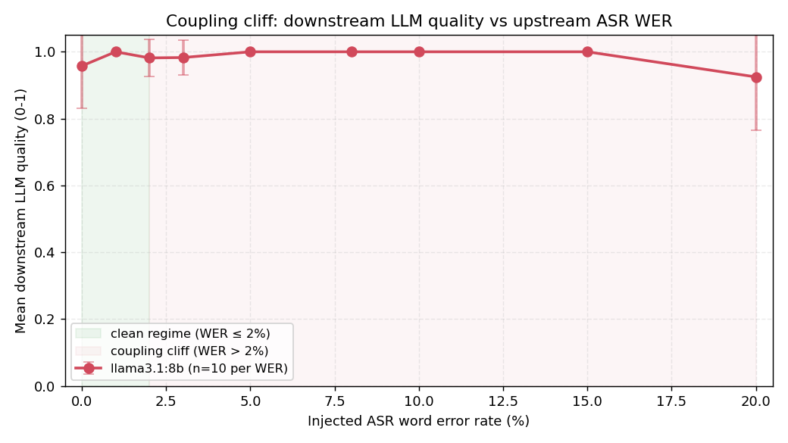

# PAVO: Pipeline-Aware Voice Orchestration

**Demand-conditioned inference routing for real-time ASR → LLM → TTS voice pipelines.**

[](https://creativecommons.org/licenses/by/4.0/)
[](#citation)
[](https://huggingface.co/datasets/vnmoorthy/pavo-bench)
[](https://www.python.org/downloads/)
[](https://github.com/vnmoorthy/pavo-bench/actions/workflows/validate.yml)
[](https://colab.research.google.com/github/vnmoorthy/pavo-bench/blob/main/notebooks/quickstart.ipynb)

PAVO treats the voice-assistant pipeline as a jointly optimizable inference graph. An **85,041-parameter** meta-controller, trained with multi-objective PPO in **106 seconds**, decides per turn whether to route each ASR → LLM → TTS call to a cloud or edge configuration. The empirical contribution is a characterization of **inter-stage coupling constraints** — quality dependencies where upstream ASR choices bound what downstream LLMs can recover from.

**Authors:** NarasingaMoorthy VeiluKanthaPerumal (University of Pennsylvania) and Mohammed Imthathullah (Google).

---

## Headline results

Measured on NVIDIA A100-SXM4-40GB and H100 (Lambda Labs), with Apple M3 8 GB for the edge configurations. 50,000 voice turns total.

| Metric | vs fixed-cloud baseline | Significance |
|---|---|---|
| P95 end-to-end latency | **−12%** | p = 2×10⁻⁶ |
| Median latency | **−34%** | |
| Energy per turn | **−71%** | |
| Meta-controller size | 85,041 parameters | — |
| Meta-controller training | 106 seconds | — |



The **coupling cliff** is the finding that motivates the router: Gemma2 2B mean quality drops from **0.825 → 0.585** as ASR WER crosses 2% (n=200 per WER level). Downstream LLM performance is not independent of upstream ASR configuration, so a router that ignores upstream state will make the wrong choice.

---

## Why this matters

Most voice-stack work optimizes ASR, LLM, and TTS independently. In practice, accuracy and latency of each stage interact: a noisy transcript pushes the LLM over a quality cliff, while an over-provisioned cloud route wastes energy on turns an edge model would have handled. PAVO provides:

1. **PAVO-Bench** — a 50K-turn voice interaction benchmark with complexity labels (40K train / 10K test), released on HuggingFace.
2. **A trained, tiny router** — 85K-parameter MLP that beats fixed-cloud on latency and energy while matching quality on coupling-safe turns.
3. **A reproducible coupling calibration** — 3,600 LLM calls across WER levels so you can reproduce the coupling cliff on your own models.

---

## Quickstart

### Python API (CPU, no ollama needed — ~30 s)

```bash
pip install git+https://github.com/vnmoorthy/pavo-bench.git
```

```python
from pavo_bench import (
    load_dataset, AlwaysCloudRouter, AlwaysEdgeRouter, HybridRouter,
    PretrainedPAVORouter, BaseRouter, benchmark_router,
)

turns = load_dataset(split="test")   # 10K test turns from HuggingFace
pavo  = PretrainedPAVORouter.from_released()  # 85K-param trained router

for R in [AlwaysCloudRouter(), AlwaysEdgeRouter(), HybridRouter(), pavo]:
    r = benchmark_router(R, turns)
    print(f"{r.router:<18s} P95={r.latency_ms_p95:>7.0f} ms   "
          f"quality={r.quality_mean:.3f}   energy={r.energy_mj_mean:>6.1f} mJ")
```

Write your own router in five lines by subclassing `BaseRouter` and returning one of `"cloud_premium"`, `"ondevice_fast"`, or `"hybrid_balanced"` from `.route(turn)`. See [`notebooks/quickstart.ipynb`](notebooks/quickstart.ipynb) (runs on free-tier Colab) or [`BLOG.md`](BLOG.md) for a walkthrough.

### Full reproduction (GPU + ollama)

```bash
git clone https://github.com/vnmoorthy/pavo-bench.git
cd pavo-bench
bash experiments/setup.sh                  # installs torch, whisper, ollama + pulls llama3.1:8b and gemma2:2b

# Run every experiment in sequence (Tier 1 + Tier 2 + Tier 3)
python experiments/run_all_experiments.py --hf-token "$HF_TOKEN"

# Or run experiments individually
python experiments/exp1_e2e_pipeline.py          # End-to-end pipeline (Tier 2)
python experiments/exp2_coupling_calibration.py  # Coupling cliff (Tier 1, 3,600 LLM calls)
python experiments/exp3_train_ppo.py             # PPO meta-controller training (~106 s on A100)
python experiments/exp4_real_ablation.py         # Component ablation with BERTScore
```

Training-only reproduction runs in **~2 minutes** on a single A100. A full reproduction of all tiers takes roughly half a day on an H100 including ollama warm-up and LibriSpeech downloads.

---

## Repository layout

```
experiments/
  setup.sh                     Install deps, ollama, and pull models
  run_all_experiments.py       Master runner (argparse: --hf-token, --skip-*)
  exp1_e2e_pipeline.py         End-to-end pipeline (Whisper + LLM on LibriSpeech)
  exp2_coupling_calibration.py Coupling cliff: n=200 per WER level, 3,600 LLM calls
  exp3_train_ppo.py            PPO meta-controller training (85K params, 106 s)
  exp4_fix.py                  Component ablation (fixed quality heuristic)
  exp4_real_ablation.py        Component ablation with BERTScore
  outputs/
    meta_controller.pt         Trained weights (85,041 params)
    meta_controller_best.pt    Best checkpoint
    training_log.json          PPO training log (100 K steps)
    coupling_results_200.json  Coupling calibration (n=200 per WER)
    ablation_bertscore.json    Real ablation with BERTScore
  outputs_new/                 Additional GPU results (3-model coupling, LibriSpeech E2E)
  scripts/supervised_baseline/ LR/RF/XGBoost/MLP-CE baselines vs PPO

tier1_statistical_results.json Statistical reproducibility (5 trials x 1,000 turns)
tier1_coupling_results.json    Coupling cliff calibration (WER 0-20%)
tier1_llm_latency_results.json LLM latency profile (short/medium/long contexts)

tier2_e2e_results.json              End-to-end cloud_premium vs edge_fast (200 LibriSpeech)
tier2_cross_dataset_results.json    Cross-dataset ASR (LibriSpeech + FLEURS)
tier2_noise_robustness_results.json ASR robustness at SNR 5-30 dB

tier3_50k_train.jsonl          PAVO-Bench train split (40,000 turns)
tier3_50k_test.jsonl           PAVO-Bench test split (10,000 turns)
tier3_50k_summary.json         Split / complexity distribution / generation stats
tier3_scaling_results.json     Per-model scaling (Gemma2 2B, Llama 3.1 8B, ...)

component_ablation_results.json Ablated configs (PAVO-Full vs PAVO-NoCoupling vs ...)
figures/                       Committed PNGs rendered from the tier*.json files
```

---

## Reproducing the headline numbers

Every number in the results table is backed by a committed script and a committed JSON result file. A one-command full reproduction:

```bash
python experiments/run_all_experiments.py --hf-token "$HF_TOKEN"
```

Or tier by tier:

| Tier | Scripts | Committed results |
|---|---|---|
| Tier 1 — components | `exp2_coupling_calibration.py` | `tier1_*.json` |
| Tier 2 — integration | `exp1_e2e_pipeline.py`, `exp4_real_ablation.py` | `tier2_*.json`, `component_ablation_results.json` |
| Tier 3 — scale | `exp3_train_ppo.py` + PAVO-Bench dataset | `tier3_*.json`, `tier3_50k_*.jsonl`, `experiments/outputs/meta_controller*.pt` |

Regenerate the committed figures from the committed JSONs at any time:

```bash
python scripts/render_figures.py
```

---

## Hardware and models

- **GPU measurements:** NVIDIA A100-SXM4-40GB (Lambda Labs); 3-model coupling ablations rerun on H100.
- **Edge measurements:** Apple M3, 8 GB.
- **ASR:** Whisper large-v3 and Whisper tiny.
- **LLM:** Llama 3.1 8B and Gemma2 2B via [ollama](https://ollama.ai). 3-model ablations also include Mistral 7B.
- **Quality scoring:** BERTScore with RoBERTa-large (plus DeBERTa-xlarge-MNLI and DistilBERT ablations).

See `paper/` for the full methodology.

---

## Citation

If you use PAVO-Bench or the meta-controller in your work, please cite:

```bibtex
@article{veilukanthaperumal2026pavo,
  title   = {PAVO: Pipeline-Aware Voice Orchestration with Demand-Conditioned Inference Routing},
  author  = {VeiluKanthaPerumal, NarasingaMoorthy and Imthathullah, Mohammed},
  journal = {Transactions on Machine Learning Research},
  year    = {2026}
}
```

GitHub also renders a "Cite this repository" button from `CITATION.cff`.

---

## Contributing

Issues and PRs are welcome — especially **reproduction reports** on model pairs we didn't test (Phi-3, Qwen2, Command-R, ...). Please use the reproduction-report issue template with your hardware, model versions, and output JSON.

See [CONTRIBUTING.md](CONTRIBUTING.md) and the [Code of Conduct](CODE_OF_CONDUCT.md).

---

## License

Code and dataset released under [CC-BY 4.0](https://creativecommons.org/licenses/by/4.0/).

## Links

- **Paper (TMLR 2026):** [`paper/`](paper/)
- **Dataset on HuggingFace:** [huggingface.co/datasets/vnmoorthy/pavo-bench](https://huggingface.co/datasets/vnmoorthy/pavo-bench)
- **Issues:** [github.com/vnmoorthy/pavo-bench/issues](https://github.com/vnmoorthy/pavo-bench/issues)
